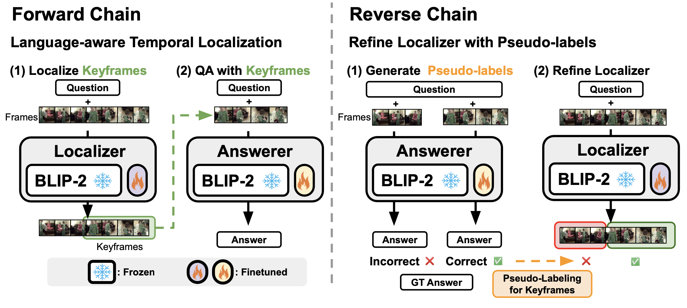
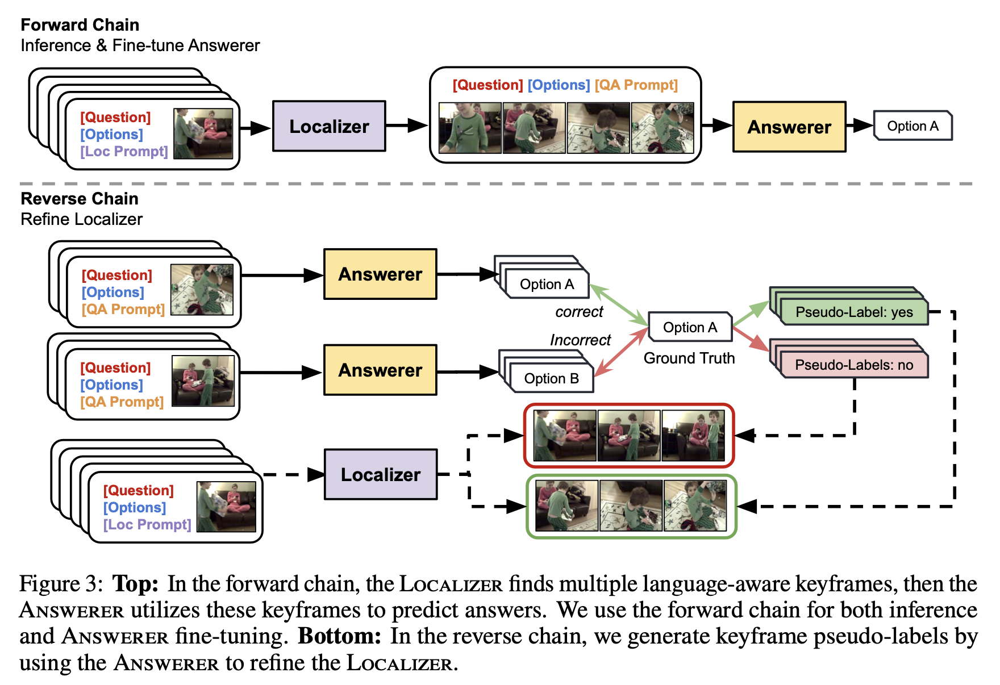

# [NeurIPS 2023] Self-Chained Image-Language Model for Video Localization and Question Answering

* Authors: [Shoubin Yu](https://yui010206.github.io/), [Jaemin Cho](https://j-min.io), [Prateek Yadav](https://prateek-yadav.github.io/), [Mohit Bansal](https://www.cs.unc.edu/~mbansal/)
* Paper: [arXiv](https://arxiv.org/abs/2305.06988)
* Online Demo: Try our Gradio demo on Hugging Face[](https://huggingface.co/spaces/Shoubin/SeViLA)







# Code structure
```bash

# data & data preprocessing
./sevila_data

# pretrained checkpoints
./sevila_checkpoints

# SeViLA code
./lavis/

# running scripts for SeViLA localizer/answerer training/inference
./run_scripts

```

# Setup

## Install Dependencies

1. (Optional) Creating conda environment

```bash
conda create -n sevila python=3.8
conda activate sevila
```

2. build from source

```bash
pip install -e .
```

## Download Pretrained Models
We pre-train SeViLA localizer on QVHighlights and hold checkpoints via [Hugging Face](https://huggingface.co/Shoubin/SeViLA/resolve/main/sevila_pretrained.pth).
Download checkpoints and put it under /sevila_checkpoints.
The checkpoints (814.55M) contains pre-trained localizer and zero-shot answerer.

If you want to pre-train your own localizer, you can download [qformer_loc.pth](https://drive.google.com/file/d/13hE_BQDflkzYrHVmVGddRSt8VMa0ouGB/view?usp=sharing), which is a copy of the original BLIP-2 Q-former to initialize the localizer (with changed model keys).

# Run Gradio Demo Locally
We also provide a UI for testing our SeViLA locally that is built with gradio. 
Running demo locally requires about 12GB of memory.

* Installing Gradio:

```bash
pip install gradio==3.30.0
```

* Running the following command in a terminal will launch the demo:

```bash
python app.py
```

# Dataset Preparation
We test our model on:
+ [NExT-QA](https://doc-doc.github.io/docs/nextqa.html)

+ [STAR](https://star.csail.mit.edu/)

+ [How2QA](https://value-benchmark.github.io/index.html)

+ [TVQA](https://tvqa.cs.unc.edu/)

+ [VLEP](https://value-benchmark.github.io/index.html)

+ [QVHighlights](https://github.com/jayleicn/moment_detr)

Please download original QA data and preprocess them via our [scripts](sevila_data/).


# Training and Inference
We provide SeViLA training and inference script examples as follows.

And please refer to [dataset page](sevila_data/) to custom your data path.

## 1) Localizer Pre-training
```bash
sh run_scripts/sevila/pre-train/pretrain_qvh.sh
```

## 2) Answerer Fine-tuning

```bash
sh run_scripts/sevila/finetune/nextqa_ft.sh
```

## 3) Localizer Self-refinement

```bash
sh run_scripts/sevila/refinement/nextqa_sr.sh
```

## 4) Inference

```bash
sh run_scripts/sevila/inference/nextqa_infer.sh
```


# Acknowledgments
We thank the developers of [LAVIS](https://github.com/salesforce/LAVIS), [BLIP-2](https://github.com/salesforce/LAVIS/tree/main/projects/blip2), [CLIP](https://github.com/openai/CLIP), [All-in-One](https://github.com/showlab/all-in-one), for their public code release.


# Reference
Please cite our paper if you use our models in your works:


```bibtex
@inproceedings{yu2023self,
  title   = {Self-Chained Image-Language Model for Video Localization and Question Answering},
  author  = {Yu, Shoubin and Cho, Jaemin and Yadav, Prateek and Bansal, Mohit},
  booktitle = {NeurIPS},
  year    = {2023}
}
